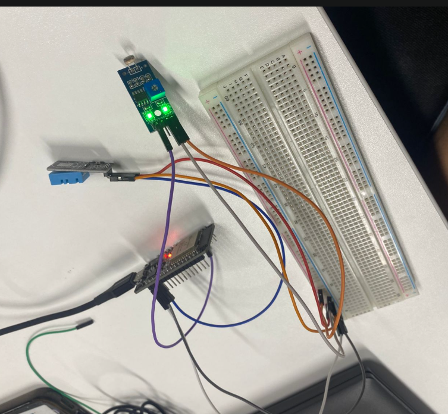

# Sprint_3-IoT-PassaABola
Entrega 3 da Sprint do Passa a Bola.

# Integrantes

<ul>
    <li>Nicolas Tetsuo Kimura - RM 565377</li>
    <li>Thomaz Vasconcelos Mendes - RM 564805</li>
    <li>Breno Henrique Bortoloti Santos - RM 564188</li>
    <li>Pedro Cunha Coutinho - RM 564188</li>
    <li>Pedro Henrique dos Santos - RM 564188</li>
</ul>

# Descrição do Projeto

Este projeto utilizando um ESP32, um sensor MPU6050(acelerômetro e griscópio) e um sensor de pulso, visa coletar dados de movimento, temperatura e frequência cardíaca. Essas informações poderiam ser exibidas em outros aparelhos via Wifi, nesse caso utilizamos a plataforma ThingSpeak para exibir tais informações.

# Arquitetura Proposta

</img>

A entrada de dados seria via o sensor de pulso conectado à porta analógica do ESP32 e o MPU6050 conectado via I2C, esses dados seria recebebidos e formatados para o envio via HTTP.

Então seriam exibidos no Serial Monitor e publicados em campos do ThingSpeak, tentdo como exemplo o pulso, temperatura e aceleração no eixo X.

# Recursos Necessários

## Hardware
<ul>
    <li>ESP32 DevKit v1</li>
    <li>MPU6050 (acelerômetro + giroscópio)</li>
    <li>Sensor de Pulso (PulseSensor)</li>
    <li>Jumpers e Protoboard</li>
</ul>

## Software

<ul>
    <li>Arduino IDE (em caso de físico)</li>
    <li>Bibliotecas Adafruit_MPU6050, Adafruit_Sensor, WiFi, HTTPClient</li>
    <li>Conta na plataforma <a href="https://thingspeak.mathworks.com/">ThingSpeak</a> </li>
</ul>

# Introdução de Uso

## Em caso de uma simulação com itens físicos
<ol>
    <li>Instale o Arduino IDE</li>
    <li>Instale as bibliotecas via o Gerenciamento de Bibliotecas</li>
    <li>Configure o código mudando as váriaveis ssid e passowrd em caso de utilização em rede Wifi ou apenas a apiKey para utilizar no ThingSpeak</li>
    <li>Conecte o ESP32 via USB</li>
    <li>Selecione o ESP32 na porta correta</li>
    <li>Mude o Serial Monitor para 115200 para visualizar dados</li>
</ol>

## Em caso de uma simulação na plataforma Wokwi

<a href="https://wokwi.com/projects/441996559014212609">Link do Projeto Wokwi</a>

<ol>
    <li>Abra o projeto Wokwi</li>
    <li>Mude a apiKey para o código Write API Key do seu ambiente ThingSpeak</li>
    <li>Certifique-se de que ssid esteja como Wokwi-Guest e passaword vazio</li>
    <li>Rode o projeto e altere as variaveis dos Sensores para visualizar no gráfico</li>
</ol>